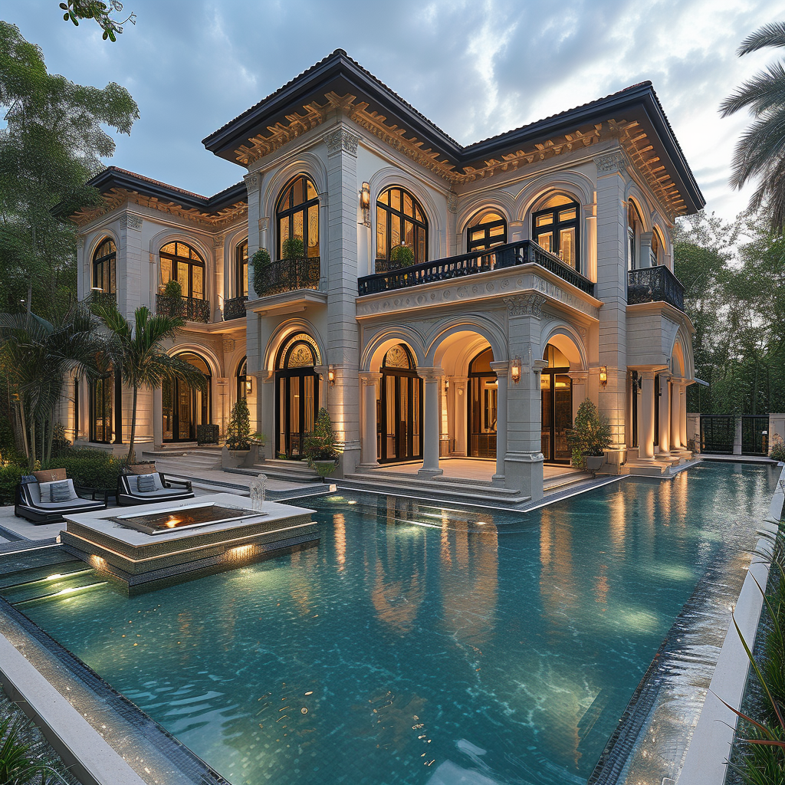

# Millionaire Mansions
Welcome to the Millionaire Mansions repository! This project showcases a collection of stunning mansion images created using the Midjourney AI. Dive into the luxurious world of millionaire mansions and get inspired by these AI-generated visuals.

## Overview
This repository contains high-quality images of millionaire mansions, each crafted with the help of Midjourney AI. Whether you’re looking for inspiration for your next project or simply want to admire the beauty of these mansions, you’ll find something captivating here.

## Images
Mansion 1

## Mansion 2

## Mansion 3
[ Millionaire Mansion 3 ](https://cdn.discordapp.com/attachments/1093703543422201946/1295870641546858590/busterpunc_a_house_that_worth_billion_dollor_with_an_infinity_p_2a7f2c23-a104-4869-83e1-732ba5324382.png?ex=67123355&is=6710e1d5&hm=be08b3cadeef2c5c29e5cbbf372247dc88f61bb5f3bc506abea9dbf987781e3e&)

## Mansion 4
[ Millonaire Mansion 4 ] (https://www.midjourney.com/jobs/6d86fb80-98e7-4b72-8108-9233eee344cf?index=0)

## About the Project
These images were generated using Midjourney AI, a powerful tool for creating stunning visuals. The AI leverages advanced algorithms to produce realistic and imaginative designs, making it a valuable resource for artists, designers, and enthusiasts.

## How to Use
Feel free to explore the images in this repository. You can download them, use them for inspiration, or incorporate them into your own projects. If you use these images, please give credit to the creator and mention this repository.

## Contributing
If you have any suggestions or would like to contribute to this project, please feel free to open an issue or submit a pull request. Contributions are always welcome!

## License
This project is licensed under the MIT License. See the LICENSE file for more details.
